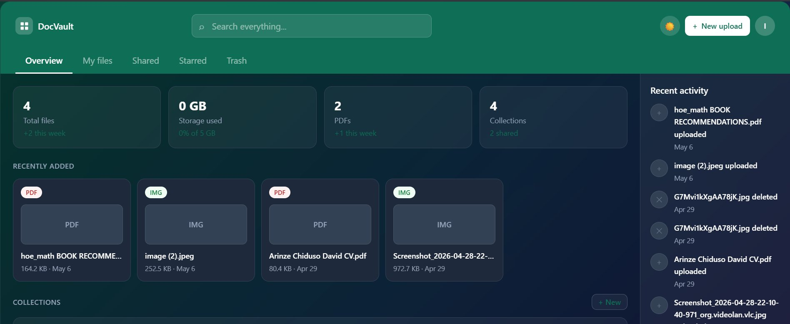

# DocVault

A private, full-stack document vault — upload, organise, preview, and share files securely.

🔗 **Live demo → [docvault-sigma.vercel.app](https://docvault-sigma.vercel.app)**




---

## Features

| | Feature |
|---|---|
| 🔐 | Email authentication — sign up, sign in, forgot password, reset password |
| 📁 | Drag-and-drop file upload with progress bar |
| 👁️ | Inline PDF preview with page navigation and zoom |
| 🗂️ | Collections — colour-coded groups for organising files |
| 🏷️ | Tags — set and filter from the UI |
| 🔗 | Shared download links — expiring signed URLs, no login required |
| ⭐ | Star files for quick access |
| ✎ | Inline file rename |
| 🔍 | Live search |
| 📊 | Stats dashboard — files, storage, PDFs, collections |
| 🕓 | Activity feed |
| 🌙 | Dark mode, persisted across sessions |
| ⚡ | Real-time updates via Supabase WebSocket |
| 📱 | Fully responsive — mobile, tablet, desktop |

---

## Tech stack

| Layer | Technology |
|---|---|
| Frontend | React 18 + Vite |
| Styling | Tailwind CSS 3 |
| Database | Supabase (PostgreSQL + Row Level Security) |
| File storage | Supabase Storage |
| Auth | Supabase Auth |
| PDF rendering | pdf.js (pdfjs-dist) |
| Deploy | Vercel (CI/CD via GitHub) |

---

## Getting started

### 1. Clone and install

```bash
git clone https://github.com/chiduso-sh/docvault.git
cd docvault
npm install
```

### 2. Set up Supabase

Create a free project at [supabase.com](https://supabase.com), then run this in **SQL Editor → New Query**:

```sql
create table collections (
  id         uuid primary key default gen_random_uuid(),
  name       text not null,
  color      text not null default '#534AB7',
  created_at timestamptz default now()
);

create table files (
  id            uuid primary key default gen_random_uuid(),
  name          text not null,
  mime_type     text,
  size_bytes    bigint,
  page_count    int,
  storage_path  text not null,
  collection_id uuid references collections(id) on delete set null,
  tag           text,
  starred       boolean default false,
  created_at    timestamptz default now()
);

create table activity_log (
  id         uuid primary key default gen_random_uuid(),
  icon       text not null default '+',
  message    text not null,
  detail     text,
  created_at timestamptz default now()
);

create or replace function get_vault_stats()
returns json language sql as $$
  select json_build_object(
    'total_files',        (select count(*) from files),
    'pdf_count',          (select count(*) from files where mime_type ilike '%pdf%'),
    'collection_count',   (select count(*) from collections),
    'shared_collections', 2,
    'files_this_week',    (select count(*) from files where created_at > now() - interval '7 days'),
    'pdfs_this_week',     (select count(*) from files where mime_type ilike '%pdf%' and created_at > now() - interval '7 days'),
    'storage_used_gb',    round((select coalesce(sum(size_bytes),0) from files)::numeric / 1e9, 2),
    'storage_pct',        round((select coalesce(sum(size_bytes),0) from files)::numeric / 5e9 * 100, 1)
  );
$$;

-- Enable RLS
alter table files enable row level security;
alter table collections enable row level security;
alter table activity_log enable row level security;

-- Policies
create policy "authenticated insert files"      on files        for insert to authenticated with check (true);
create policy "authenticated select files"      on files        for select to authenticated using (true);
create policy "authenticated update files"      on files        for update to authenticated using (true);
create policy "authenticated delete files"      on files        for delete to authenticated using (true);
create policy "authenticated select collections" on collections for select to authenticated using (true);
create policy "authenticated insert collections" on collections for insert to authenticated with check (true);
create policy "authenticated insert activity"   on activity_log for insert to authenticated with check (true);
create policy "authenticated select activity"   on activity_log for select to authenticated using (true);
```

**Storage bucket** — go to **Storage → New bucket**:
- Name: `vault`
- Public: **off**
- Allowed MIME types: `application/pdf,application/msword,application/vnd.openxmlformats-officedocument.wordprocessingml.document,application/vnd.ms-excel,application/vnd.openxmlformats-officedocument.spreadsheetml.sheet,image/*`

Add two storage policies (**Storage → vault → Policies → For full customization**):
- **INSERT** — role: `authenticated`, definition: `bucket_id = 'vault' AND auth.role() = 'authenticated'`
- **SELECT** — role: `authenticated`, definition: `bucket_id = 'vault' AND auth.role() = 'authenticated'`

**Auth settings** — go to **Authentication → URL Configuration**:
- Site URL: `https://your-app.vercel.app`
- Redirect URLs: add `https://your-app.vercel.app/reset-password`

### 3. Environment variables

```bash
cp .env.example .env
```

Fill in from **Supabase Dashboard → Settings → API**:

```
VITE_SUPABASE_URL=https://your-project-id.supabase.co
VITE_SUPABASE_ANON_KEY=your-anon-key
```

### 4. Run locally

```bash
npm run dev
```

---

## Project structure

```
src/
├── components/
│   ├── DocVault.jsx          # Root — owns all UI state
│   ├── Header.jsx            # Search, tabs, dark mode, upload, sign out
│   ├── StatsRow.jsx          # Metric cards with loading skeletons
│   ├── FileCard.jsx          # Card with open, star, rename, tag, share, delete
│   ├── PdfPreviewModal.jsx   # Inline PDF viewer (pdf.js)
│   ├── ShareModal.jsx        # Generate expiring download links
│   ├── TagModal.jsx          # Edit file tags
│   ├── UploadModal.jsx       # Drag-and-drop upload with progress bar
│   ├── CollectionModal.jsx   # Create collections
│   ├── RightPanel.jsx        # Activity feed + tag filter cloud
│   ├── Toast.jsx             # Auto-dismissing notifications
│   ├── LoginPage.jsx         # Sign in / sign up / forgot password
│   └── ResetPassword.jsx     # Password reset (handles magic link redirect)
├── hooks/
│   └── useVault.js           # All Supabase data fetching and mutations
├── lib/
│   ├── supabase.js           # Supabase client singleton
│   ├── AuthContext.jsx       # Session state + route guard
│   └── useDarkMode.js        # Dark mode toggle, persisted to localStorage
└── main.jsx                  # Entry point + client-side routing
```

---

## Deployment

Push to GitHub and import the repo on [Vercel](https://vercel.com). Add your two environment variables in the Vercel dashboard and deploy. Every `git push` to `main` triggers an automatic redeploy.

```bash
npm run build   # local build check
git add .
git commit -m "your message"
git push
```
